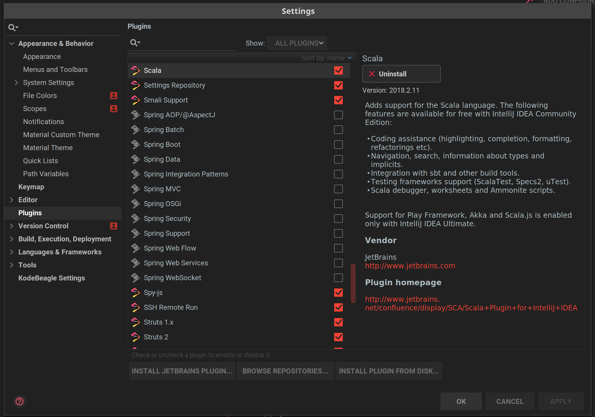
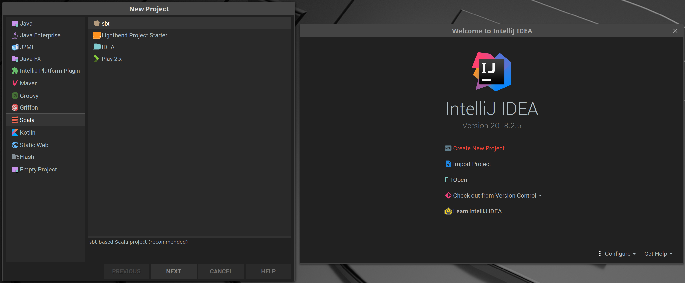
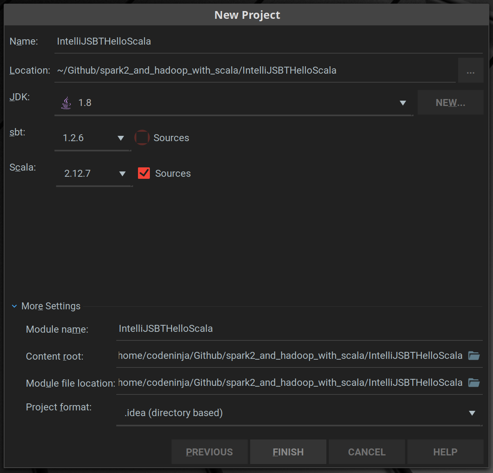
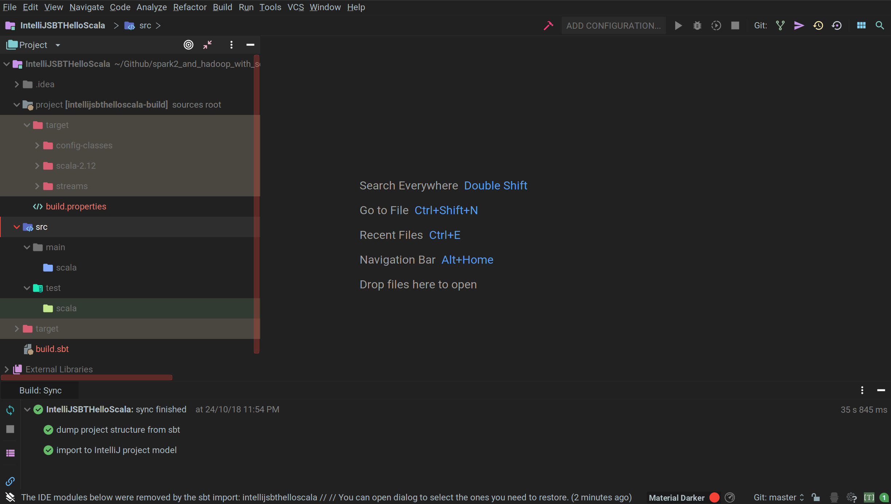

# Installation Guide

## Requirements

| Package         | Version | OS            | Link/Reference                          |
| --------------- | ------- | ------------- | --------------------------------------- |
| Oracle Java JDK | 1.8.0_x | Linux Mint 19 | Nil                                     |
| Scala           | 21.11.8 | Linux Mint 19 | Nil                                     |
| Apache Spark    | 2.1.3   | Linux Mint 19 | https://spark.apache.org/downloads.html |
|                 |         |               |                                         |

## Java JDK

```bash
$ sudo add-apt-repository ppa:webupd8team/java
$ sudo apt-get update
$ sudo apt-get install oracle-java8-installer
$ sudo apt-get install oracle-java8-set-default
$ java -version
java version "1.8.0_191"
Java(TM) SE Runtime Environment (build 1.8.0_191-b12)
Java HotSpot(TM) 64-Bit Server VM (build 25.191-b12, mixed mode)
```

### Optional Check Default

```bash
$ sudo update-alternatives --display java
java - manual mode
  link best version is /usr/lib/jvm/java-11-openjdk-amd64/bin/java
  link currently points to /usr/lib/jvm/java-8-oracle/jre/bin/java
  link java is /usr/bin/java
  slave java.1.gz is /usr/share/man/man1/java.1.gz
/usr/lib/jvm/java-11-openjdk-amd64/bin/java - priority 1101
  slave java.1.gz: /usr/lib/jvm/java-11-openjdk-amd64/man/man1/java.1.gz
/usr/lib/jvm/java-8-oracle/jre/bin/java - priority 1081
  slave java.1.gz: /usr/lib/jvm/java-8-oracle/man/man1/java.1.gz
$ sudo update-alternatives --list java
/usr/lib/jvm/java-11-openjdk-amd64/bin/java
/usr/lib/jvm/java-8-oracle/jre/bin/java
$ sudo update-alternatives --config java
There are 2 choices for the alternative java (providing /usr/bin/java).

  Selection    Path                                         Priority   Status
------------------------------------------------------------
  0            /usr/lib/jvm/java-11-openjdk-amd64/bin/java   1101      auto mode
  1            /usr/lib/jvm/java-11-openjdk-amd64/bin/java   1101      manual mode
* 2            /usr/lib/jvm/java-8-oracle/jre/bin/java       1081      manual mode

Press <enter> to keep the current choice[*], or type selection number: 

```

### Information about Java

```bash
$ java -XshowSettings:properties -version
```

## Spark

```bash
$ tar -xvf spark-2.1.3-bin-hadoop2.7.tgz -C /usr/local/
$ sudo ln -s /usr/local/spark-2.1.3-bin-hadoop2.7/ /usr/local/spark
$ cd /usr/local/spark
$ echo "# SPARK" >> ~/.bashrc
$ echo "export SPARK_HOME=/usr/local/spark" >> ~/.bashrc
$ echo "export PATH=$SPARK_HOME/bin:$PATH" >> ~/.bashrc
$ source ~/.bashrc
$ spark-submit --version
Welcome to
      ____              __
     / __/__  ___ _____/ /__
    _\ \/ _ \/ _ `/ __/  '_/
   /___/ .__/\_,_/_/ /_/\_\   version 2.1.3
      /_/
                        
Using Scala version 2.11.8, Java HotSpot(TM) 64-Bit Server VM, 1.8.0_191
Branch 
Compiled by user  on 2018-06-26T16:50:16Z
Revision 
Url 
Type --help for more information.
```

### Start a Spark Shell

```bash
$ spark-shell
Using Spark's default log4j profile: org/apache/spark/log4j-defaults.properties
Setting default log level to "WARN".
To adjust logging level use sc.setLogLevel(newLevel). For SparkR, use setLogLevel(newLevel).
18/10/24 00:47:32 WARN NativeCodeLoader: Unable to load native-hadoop library for your platform... using builtin-java classes where applicable
18/10/24 00:47:32 WARN Utils: Your hostname, CN55-XPS-Mint resolves to a loopback address: 127.0.1.1; using 192.168.5.13 instead (on interface wlp58s0)
18/10/24 00:47:32 WARN Utils: Set SPARK_LOCAL_IP if you need to bind to another address
Spark context Web UI available at http://192.168.5.13:4040
Spark context available as 'sc' (master = local[*], app id = local-1540302452799).
Spark session available as 'spark'.
Welcome to
      ____              __
     / __/__  ___ _____/ /__
    _\ \/ _ \/ _ `/ __/  '_/
   /___/ .__/\_,_/_/ /_/\_\   version 2.1.3
      /_/
         
Using Scala version 2.11.8 (Java HotSpot(TM) 64-Bit Server VM, Java 1.8.0_191)
Type in expressions to have them evaluated.
Type :help for more information.

scala> sc.version
res0: String = 2.1.3

```


## IDE (Optional)

### Jetbrains IntelliJ IDEA

Ensure the IntelliJ Scala Plugin is installed at _Settings > Plugins > Browse Repositories > Scala_.



#### Creating a new sbt IntelliJ IDEA project

To create a new project, start IntelliJ IDE and select _Create New Project_ or _File > New > Project_.



Select _Scala_ and _sbt_ and then name your project.



The project should now look something like this after building.



The project structure should be something like this:name := "IntelliJSBTHelloScala"

version:= "1.0"

scalaVersion := ""

* _.idea_
  * IntelliJ IDEA configuration files.
* _project_
  * Files used during compilation. For example, build.properties allows you to change the SBT version used when compiling your project.
* _src_
  * Source code. Most of your code should go into the main directory. The test folder should be reserved for test scripts.
* _target_
  * When you compile your project will go here.
* _build.sbt_
  * The SBT configuration file. We’ll show you how to use this file to import third party libraries and documentation. 

### SBT

Before building a Spark application, import the Spark libraries and documentation with IntelliJ. To perform this we will use SBT. This is necessary if we want IntelliJ to recognize Spark code. Add the following lines to the file `build.sbt`

```scala
name := "IntelliJSBTHelloScala"

version := "0.1"

scalaVersion := "2.11.8"

// https://mvnrepository.com/artifact/org.apache.spark/spark-code
libraryDependencies += "org.apache.spark" %% "spark-core" % "2.1.3"
```

#### SBT Syntax for Importing

All imports in SBT follow this format:

`Group ID % Artifact Id % Revision`

Where:

* Group ID is “org.apache.spark”
* Artifact ID is “spark-core”
* Revision is “2.1.3”

The `%%` syntax additionally appends the Scala version, in our case transforming “spark-core” to “spark-core_2.1”.